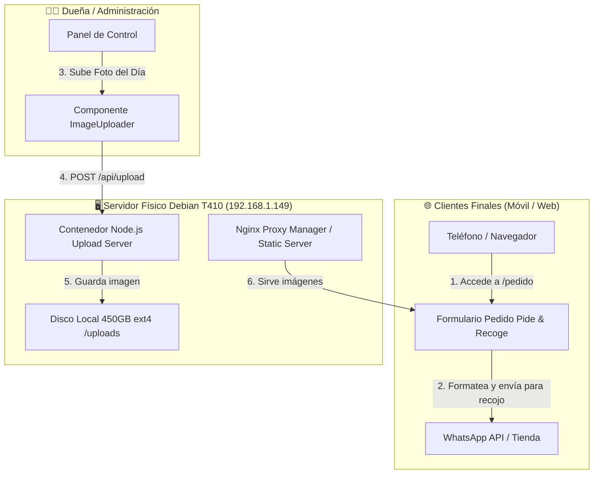

# 🥦 VerdurasPro — Sistema de Pedidos Express & Dashboard Financiero On-Premise

[](https://react.dev/)
[](https://vitejs.dev/)
[](https://www.typescriptlang.org/)
[](https://tailwindcss.com/)
[](https://www.docker.com/)
[](https://www.debian.org/)

Plataforma web integral de comercio electrónico y gestión empresarial diseñada específicamente para verdulerías y negocios de productos frescos. El sistema combina un **flujo de pedido de conversión ultra-rápida sin fricción (estilo Google Forms) para RECOGER EN TIENDA / LOCAL (Click & Collect)** para los clientes, junto con un **Panel Ejecutivo de Control Financiero (KPIs de Ingresos, Inversión y Mermas)** y almacenamiento de imágenes **Self-Hosted On-Premise** (cero costo de almacenamiento en la nube).

---

## 🎯 Arquitectura del Sistema & Flujo de Datos

El sistema está diseñado bajo una arquitectura desacoplada y eficiente que aprovecha un servidor físico local Debian (ThinkPad T410 @ `192.168.1.149`) para almacenar y servir las fotografías diarias de los productos frescos.



---

## 🚀 Características Principales

### 1. ⚡ Módulo "Pide & Recoge en Tienda" (Estilo Google Forms)
- **Ruta Pública (`/pedido`):** Acceso directo para clientes sin necesidad de crear cuenta ni iniciar sesión (Cero Fricción = Máximas Ventas).
- **Catálogo Visual de Fotos del Día:** Muestra las fotografías reales recién tomadas de las verduras frescas.
- **Selectores Táctiles (+/-):** Selección de cantidad dinámica en kilos (0.5kg, 1kg) o unidades con cálculo de subtotal en vivo.
- **Formulario Mínimo de Recojo:** Captura de Nombre, Teléfono, Hora estimada de recojo en mostrador y Método de Pago (Efectivo al recoger / Transferencia previa).
- **Integración Instantánea con WhatsApp:** Botón flotante omnipresente `⚡ PEDIR PARA RECOGER` que genera un mensaje perfectamente estructurado para que en el local pesen, empaqueten y tengan listo el pedido cuando llegue el cliente.

### 2. 📸 Almacenamiento de Fotos Self-Hosted (Cero Costos de Nube)
- **Microservicio Node.js & Express (`server/index.js`):** Endpoint de carga `/api/upload` gestionado por Multer con validación de tipo Mime y límites de peso.
- **Despliegue en Docker Container (`docker-compose.yml`):** Listo para correr en Portainer CE o directamente en el sistema operativo Debian 13.
- **Fallback Inteligente:** En caso de fallas de red o entornos de desarrollo aislados, el cliente convierte temporalmente la imagen a Data URL para no interrumpir el flujo.

### 3. 📊 Dashboard de Análisis Financiero & Mermas
- **Métricas Ejecutivas en Tiempo Real:**
  - **Ventas Estimadas:** Retorno esperado según inventario activo.
  - **Costo de Inversión:** Capital gastado en compra de mercancía.
  - **Pérdidas por Merma:** Control cuantitativo ($ y kg) de verdura echada a perder o regalada.
  - **Ganancia Neta Real:** Cálculo preciso `(Ventas - Compras - Pérdidas)`.
- **Gráficos de Barras Comparativos (Recharts):** Visualización clara del balance financiero.
- **Módulo de Registro de Mermas:** Registro rápido por producto para restar stock sobrante y contabilizar la pérdida en el balance general.

### 4. 📱 Diseño Mobile-First & Responsividad Senior
- Optimizado para viewports desde 375px (iPhone SE, Androids pequeños) hasta pantallas de escritorio de gran resolución.
- Tipografía ajustada para prevenir el zoom automático no deseado en teclados táctiles móviles (iOS Safari).
- Cumplimiento de estándares de accesibilidad en metas de Viewport (`viewport-fit=cover`).

---

## 🛠️ Tech Stack

### Frontend & UI
- **Core:** [React 19](https://react.dev/) + [TypeScript 5.9](https://www.typescriptlang.org/) + [Vite 7](https://vitejs.dev/)
- **Estilos & Utility-First CSS:** [TailwindCSS 3.4](https://tailwindcss.com/)
- **Componentes UI:** [Radix UI](https://www.radix-ui.com/)
- **Visualización de Datos:** [Recharts 3.7](https://recharts.org/)
- **Animaciones:** [Framer Motion 12](https://www.framer.com/motion/)
- **Iconografía:** [Lucide React](https://lucide.dev/)

### Backend & Infrastructure (On-Premise)
- **Microservicio Upload:** Node.js + Express + Multer + CORS
- **Contenedores:** Docker & Docker Compose (Alpine Linux Base Image)
- **Servidor Físico:** Laptop ThinkPad T410 (Intel Core i3, 4GB RAM, 450GB ext4)
- **Sistema Operativo Servidor:** Debian GNU/Linux 13 (Trixie) Headless
- **Proxy Reverse:** Nginx Proxy Manager & Portainer CE

---

## 📂 Estructura del Proyecto

```text
administradordecompra/
├── docker-compose.yml          # Configuración de Docker Compose para el microservicio de fotos
├── index.html                  # HTML5 Entry Point con Viewport Meta Tags Responsivos
├── package.json                # Dependencias del Frontend (React, Radix, Recharts, Vite)
├── postcss.config.js           # Configuración de PostCSS / Tailwind
├── tailwind.config.js          # Tokens de diseño y paleta de colores de Tailwind
├── tsconfig.json               # Configuración global de TypeScript
├── vite.config.ts              # Configuración del bundler Vite & Aliases (@/)
│
├── server/                     # 🖥️ Microservicio Backend de Fotos
│   ├── Dockerfile              # Dockerfile de producción basado en Node 20 Alpine
│   ├── index.js                # Servidor Express, endpoints /api/upload y archivos estáticos
│   ├── package.json            # Dependencias del microservicio (express, multer, cors)
│   └── uploads/                # Directorio en disco ext4 donde se almacenan las fotos
│
└── src/                        # 💻 Código Fuente Frontend
    ├── main.tsx                # Punto de entrada principal de React
    ├── App.tsx                 # Enrutamiento público (/pedido) y rutas protegidas
    ├── index.css               # Estilos globales y utilidades personalizadas
    │
    ├── components/             # Componentes React Reutilizables
    │   ├── ImageUploader.tsx   # Componente de subida de imágenes con integración al ThinkPad T410
    │   ├── forms/              # Formularios de Registro de Compras y Ventas
    │   ├── layout/             # Header, Sidebar responsivo y AppLayout
    │   └── ui/                 # Primitivas de interfaz (Button, Card, Input, Dialog, Badge)
    │
    ├── hooks/                  # Custom React Hooks
    │   ├── useProductos.tsx    # Contexto global de Productos, Precios, Fotos y Mermas
    │   ├── useAuth.tsx         # Gestión de Estado de Autenticación
    │   └── useTheme.tsx        # Toggle de Modo Oscuro / Claro
    │
    ├── lib/                    # Utilidades y Helper Functions
    │   └── calculations.ts     # Formateadores de moneda (MXN), porcentajes y cálculos
    │
    ├── pages/                  # Vistas Principales de la Aplicación
    │   ├── PedidoExpress.tsx   # ⚡ Vista Pública de Pedidos Estilo Google Forms
    │   ├── Productos.tsx       # Gestión de Catálogo, Precios Venta/Compra y Mermas
    │   ├── Analisis.tsx        # 📊 Dashboard de KPIs Financieros y Pérdidas
    │   ├── Dashboard.tsx       # Métrica general del negocio
    │   ├── Compras.tsx         # Registro de Entradas / Inversión
    │   ├── Ventas.tsx          # Registro de Salidas / Facturación
    │   └── Login.tsx           # Inicio de sesión de la dueña del negocio
    │
    └── types/                  # Definiciones de Tipos de TypeScript (Producto, Merma, Venta)
```

---

## 🛠️ Instalación & Ejecución Local (Desarrollo)

### Prerrequisitos
- **Node.js:** `v20.0.0` o superior.
- **npm:** `v10.0.0` o superior.

### 1. Clonar el Repositorio e Instalar Dependencias del Frontend
```bash
cd administradordecompra
npm install
```

### 2. Iniciar el Servidor de Desarrollo Frontend
```bash
npm run dev
```
La aplicación web estará disponible en `http://localhost:5173`.
- **Formulario de Pedidos (Clientes):** `http://localhost:5173/pedido`
- **Panel Administrativo (Dueña):** `http://localhost:5173/`

### 3. Iniciar el Servidor Local de Imágenes (Servidor Node.js)
En una segunda consola:
```bash
cd administradordecompra/server
npm install
npm start
```
El microservicio de imágenes responderá en `http://localhost:3001`.

---

## 🐳 Despliegue en Servidor Físico (Debian T410 @ 192.168.1.149)

### 1. Levantar el Microservicio de Imágenes con Docker Compose
En el servidor Debian 13 (vía SSH o terminal):
```bash
cd /ruta/a/administradordecompra
docker-compose up -d --build
```
Verifica que el servicio esté saludable ejecutando:
```bash
curl http://192.168.1.149:3001/api/health
```

### 2. Compilar el Frontend para Producción
En el entorno de integración continua o en el servidor:
```bash
npm run build
```
Los archivos estáticos optimizados se generarán en el directorio `dist/`.

### 3. Configuración en Nginx Proxy Manager
1. Crea un nuevo **Proxy Host** en tu panel de Nginx Proxy Manager (puerto 9000).
2. Apunta el tráfico de tu dominio/IP local a la carpeta `dist/` para la aplicación web.
3. Mapea la ruta `/uploads/` y `/api/` a `http://192.168.1.149:3001`.

---

## 📑 Comandos de Calidad & Compilación

| Comando | Descripción |
| :--- | :--- |
| `npm run dev` | Inicia el servidor de desarrollo de Vite con HMR. |
| `npm run build` | Compila TypeScript (`tsc -b`) y genera el bundle optimizado para producción (`dist/`). |
| `npm run preview` | Previsualiza localmente el build de producción. |
| `npm test` | Ejecuta la suite de pruebas unitarias con Vitest. |

---

## 📄 Licencia

Este proyecto está licenciado bajo la **Licencia MIT** - uso libre para fines comerciales y privados.

---

<p center="text-center" style="font-weight: bold; color: #10B981;">
  Desarrollado con ❤️ para maximizar ventas y control financiero en negocios locales de productos frescos.
</p>
